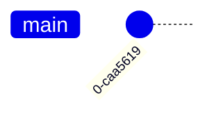

# learn-flow-1
git flow

- main
	- bugfix-0.1
	- bugfix-0.2
- develop
	- feature-0.1
	- feature-0.2
	- release-1.0

### feature

- feature-0.1 分支：建立 f1
- feature-0.2 分支：建立 f2

完成後合併回 develop

- feature-0.3 分支：建立 f3

### bugfix

- bugfix-1.0：